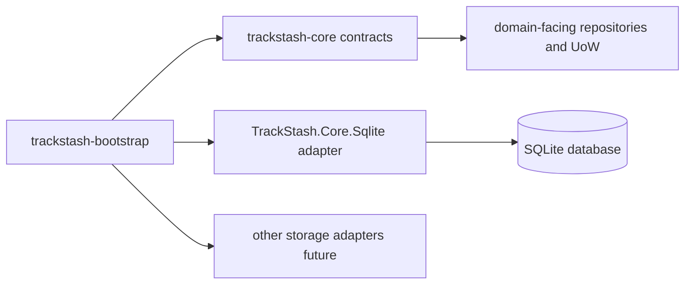

# trackstash-bootstrap

Bootstrap and orchestration module for TrackStash.

## Overview

`trackstash-bootstrap` is responsible for first-run and operational setup tasks.
It wires together shared storage contracts and concrete adapters so a local or environment-specific TrackStash instance can be initialized consistently.

This module is intentionally **not** the owner of domain models, repository contracts, or provider internals.

## Current Status

Status: design and planning stage.

At the moment this folder contains module guidance and intended boundaries while command tooling is being defined.

## Why This Module Exists

TrackStash has multiple focused modules (scan, organize, transcode, core contracts, storage adapters, etc.).
A dedicated bootstrap module keeps setup concerns in one place:

- initialize database files and directories
- apply pending schema migrations
- seed starter reference data
- kick off optional first-run workflows
- report runtime/storage readiness

This avoids spreading operational setup logic across domain modules.

## How It Fits In The Project

`trackstash-bootstrap` sits at the edge of the system and composes dependencies.
It should call into contracts and adapters owned elsewhere.

Related module docs:

- `../trackstash-core/README.md`
- `../trackstash-core/docs/ecosystem-modules.md`
- `../trackstash-core/docs/storage-interface.md`

## Responsibilities

`trackstash-bootstrap` should own:

- environment/bootstrap orchestration
- migration execution orchestration
- seed/import orchestration for starter data
- startup diagnostics and status reporting
- command-level error handling and exit codes

`trackstash-bootstrap` should not own:

- canonical domain contract definitions
- repository interface design
- low-level SQL/storage implementation details
- scan extraction or media fingerprinting logic
- matching, tagging, or file organization business logic

## Planned Command Surface (Placeholder)

Final names and flags are still TBD. Current proposal:

- `trackstash-bootstrap init-db`
- `trackstash-bootstrap migrate`
- `trackstash-bootstrap seed-label`
- `trackstash-bootstrap seed-artist`
- `trackstash-bootstrap seed-release`
- `trackstash-bootstrap seed-recording`
- `trackstash-bootstrap status`

Potential future commands:

- `trackstash-bootstrap import-csv`
- `trackstash-bootstrap doctor`
- `trackstash-bootstrap repair-indexes`

## Expected Execution Model

Typical flow for first run:

1. Resolve configuration (database path, environment, provider).
2. Construct storage provider (SQLite first).
3. Run migrations to latest version.
4. Seed optional starter records.
5. Emit readiness/status output.

Typical flow for ongoing operations:

1. Validate connectivity and provider capabilities.
2. Run idempotent migration check.
3. Run targeted seed/import command.
4. Exit with machine-friendly status code and human-readable summary.

## Dependencies

Primary dependencies:

- `trackstash-core` for shared storage contracts and models
- `TrackStash.Core.Sqlite` (or future adapters) for concrete provider behavior

Optional future integrations:

- catalog ingestion modules for bulk reference imports
- configuration/secrets modules for environment-driven setup

## Configuration (Placeholder)

Configuration shape is still being finalized. Likely inputs:

- database file path or connection string
- storage provider selection
- migration mode (`auto`, `manual`, `off`)
- seed source paths (CSV/JSON)
- logging verbosity

## Testing Strategy (Placeholder)

Planned testing split:

- unit tests for command parsing and orchestration logic
- integration tests for init/migrate/seed against temporary SQLite databases
- smoke tests for expected status/exit code behavior

## Near-Term Milestones

1. Scaffold executable project for this module.
2. Implement `init-db` and `status` as first commands.
3. Add `seed-label` end-to-end path.
4. Add integration tests using temp DB lifecycle.
5. Document stable CLI contract once command names/flags are finalized.
