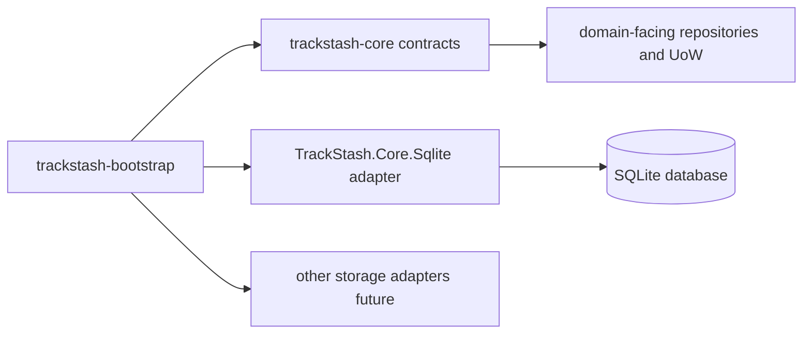

# trackstash-bootstrap

Bootstrap and orchestration module for TrackStash.

## Overview

`trackstash-bootstrap` is responsible for first-run and operational setup tasks.
It wires together shared storage contracts and concrete adapters so a local or environment-specific TrackStash instance can be initialized consistently.

This module is intentionally **not** the owner of domain models, repository contracts, or provider internals.

## Current Status

Status: MVP implementation complete.

Commands available: `status`, `init-db`, `migrate`, `import-csv`, `seed-label`, `seed-artist`, `seed-release`, `seed-recording`.  
Config file support (YAML), JSON output mode, and environment variable overrides are implemented.

## Why This Module Exists

TrackStash has multiple focused modules (scan, organize, transcode, core contracts, storage adapters, etc.).
A dedicated bootstrap module keeps setup concerns in one place:

- initialize database files and directories
- apply pending schema migrations
- seed starter reference data
- kick off optional first-run workflows
- report runtime/storage readiness

This avoids spreading operational setup logic across domain modules.

## How It Fits In The Project

`trackstash-bootstrap` sits at the edge of the system and composes dependencies.
It should call into contracts and adapters owned elsewhere.



Related module docs:

- `../trackstash-core/README.md`
- `../trackstash-core/docs/ecosystem-modules.md`
- `../trackstash-core/docs/storage-interface.md`

## Responsibilities

`trackstash-bootstrap` should own:

- environment/bootstrap orchestration
- migration execution orchestration
- seed/import orchestration for starter data
- startup diagnostics and status reporting
- command-level error handling and exit codes

`trackstash-bootstrap` should not own:

- canonical domain contract definitions
- repository interface design
- low-level SQL/storage implementation details
- scan extraction or media fingerprinting logic
- matching, tagging, or file organization business logic

## Getting Started

### Prerequisites

- .NET 8 SDK

### 1. Copy and edit the config file

```bash
cp trackstash-bootstrap.template.yml trackstash-bootstrap.yml
```

Open `trackstash-bootstrap.yml` and set the database path:

```yaml
sqlite:
  dbPath: /path/to/your/trackstash.db
```

### 2. Initialize the database

```bash
dotnet run --project src/TrackStash.Bootstrap -- init-db --config ./trackstash-bootstrap.yml
```

This creates the database file if it does not exist and applies all pending schema migrations.

If you only want to apply pending migrations to an existing database, use:

```bash
dotnet run --project src/TrackStash.Bootstrap -- migrate --config ./trackstash-bootstrap.yml
```

Example output:

```text
provider: sqlite
database: /path/to/your/trackstash.db
currentVersion: 1
appliedMigrations: 1
status: ready
```

### 3. Check status

```bash
dotnet run --project src/TrackStash.Bootstrap -- status --config ./trackstash-bootstrap.yml
```

### 4. Seed a label

```bash
dotnet run --project src/TrackStash.Bootstrap -- seed-label --config ./trackstash-bootstrap.yml --name "Virelith Records"
```

Repeat with name variations — the normalizer deduplicates them automatically:

```bash
dotnet run --project src/TrackStash.Bootstrap -- seed-label --config ./trackstash-bootstrap.yml --name "Virelith"
# action: ReusedByNormalizedName
```

### 5. Seed a release

```bash
dotnet run --project src/TrackStash.Bootstrap -- seed-release --config ./trackstash-bootstrap.yml --title "Virelith Sessions" --label-id <label-id>
```

You can also attach a release credit once the artist exists:

```bash
dotnet run --project src/TrackStash.Bootstrap -- seed-release --config ./trackstash-bootstrap.yml --title "Virelith Sessions" --label-id <label-id> --artist-id <artist-id>
```

### 6. Seed a recording

```bash
dotnet run --project src/TrackStash.Bootstrap -- seed-recording --config ./trackstash-bootstrap.yml --title "Signal Drift" --release-id <release-id> --track-number 1
```

To seed a relationship, point at a recording that already exists:

```bash
dotnet run --project src/TrackStash.Bootstrap -- seed-recording --config ./trackstash-bootstrap.yml --title "Signal Drift (Remix)" --related-recording-id <recording-id> --relationship-type remix_of
```

### Config file vs CLI flags

All options can be passed as CLI flags instead of using a config file:

```bash
dotnet run --project src/TrackStash.Bootstrap -- init-db --db-path ./trackstash.db
```

Resolution order (highest wins):

1. CLI flags
2. Environment variables (`TRACKSTASH_SQLITE_DB_PATH`, `TRACKSTASH_PROVIDER`, etc.)
3. Config file (`--config <path>` or `TRACKSTASH_CONFIG` env var)
4. Defaults

### JSON output mode

Add `--output json` to any command for machine-readable output:

```bash
dotnet run --project src/TrackStash.Bootstrap -- status --config ./trackstash-bootstrap.yml --output json
```

### Import CSV

`import-csv` is implemented as a thin bootstrap wrapper over `TrackStash.Core.Services.CatalogImportService`.
That keeps the import logic reusable for future lifecycle tooling such as `trackstash-catalog`.

Current CSV schema:

- `type` — required, one of `label`, `artist`, `release`, `recording`
- `id` — optional stable ID to use for the canonical row
- `name` — required for `label` and `artist`
- `title` — required for `release` and `recording`
- `sort_name` — optional for `artist`
- `mix_name` — optional for `recording`
- `isrc` — optional for `recording`
- `label_ref` — optional reference used by `release`
- `artist_ref` — optional reference used by `release` and `recording`
- `artist_role` — optional for `recording`, defaults to `primary`
- `release_ref` — optional reference used by `recording`
- `disc_number` and `track_number` — optional for `recording`
- `source` and `external_id` — optional external reference pair

Reference resolution order:

1. entities imported earlier in the same run
2. existing rows already present in the database
3. unresolved reference warning when no match is found

Unresolved links do not currently fail the row by default. Use `--fail-fast` if you want the import to stop on the first failed row.

Example:

```csv
type,name,title,label_ref,artist_ref,release_ref,mix_name,isrc
label,Virelith Records,,,,,,
artist,Bozra Bozra,,,,,,
release,,Virelith Sessions,Virelith Records,Bozra Bozra,,,
recording,,Signal Drift,,Bozra Bozra,Virelith Sessions,Original Mix,TST000000001
```

## Command Reference

```text
trackstash-bootstrap status     --db-path <path> | --config <path>
trackstash-bootstrap init-db    --db-path <path> | --config <path>
trackstash-bootstrap migrate    --db-path <path> | --config <path>
trackstash-bootstrap import-csv --db-path <path> | --config <path> --file <path.csv> [--dry-run] [--fail-fast]
trackstash-bootstrap seed-label --db-path <path> | --config <path> --name <name> [--id <id>] [--source <provider> --external-id <id>]
trackstash-bootstrap seed-artist --db-path <path> | --config <path> --name <name> [--id <id>] [--sort-name <sort>] [--source <provider> --external-id <id>]
trackstash-bootstrap seed-release --db-path <path> | --config <path> --title <title> [--id <id>] [--label-id <id>] [--artist-id <id>] [--source <provider> --external-id <id>]
trackstash-bootstrap seed-recording --db-path <path> | --config <path> --title <title> [--id <id>] [--mix-name <mix>] [--isrc <isrc>] [--release-id <id>] [--disc-number <n>] [--track-number <n>] [--artist-id <id>] [--artist-role <role>] [--related-recording-id <id>] [--relationship-type <type>] [--relationship-source <source>] [--relationship-confidence <value>] [--relationship-notes <text>] [--source <provider> --external-id <id>]
```text

Global options (any command):

- `--config <path>` — path to YAML config file
- `--output json` — JSON output mode
- `--verbosity <quiet|normal|detailed|debug>`

## Planned Command Surface

Implemented:

- `trackstash-bootstrap status`
- `trackstash-bootstrap init-db`
- `trackstash-bootstrap migrate`
- `trackstash-bootstrap import-csv`
- `trackstash-bootstrap seed-label`
- `trackstash-bootstrap seed-artist`
- `trackstash-bootstrap seed-release`
- `trackstash-bootstrap seed-recording`

Planned next:

- `trackstash-bootstrap doctor`
- `trackstash-bootstrap repair-indexes`

## Expected Execution Model

Typical flow for first run:

1. Resolve configuration (database path, environment, provider).
2. Construct storage provider (SQLite first).
3. Run migrations to latest version.
4. Seed optional starter records.
5. Emit readiness/status output.

Typical flow for ongoing operations:

1. Validate connectivity and provider capabilities.
2. Run idempotent migration check.
3. Run targeted seed/import command.
4. Exit with machine-friendly status code and human-readable summary.

## Dependencies

Primary dependencies:

- `trackstash-core` for shared storage contracts and models
- `TrackStash.Core.Sqlite` (or future adapters) for concrete provider behavior

Optional future integrations:

- catalog ingestion modules for bulk reference imports
- configuration/secrets modules for environment-driven setup

## Configuration

See [trackstash-bootstrap.template.yml](trackstash-bootstrap.template.yml) for a fully annotated config template.

Config keys:

- `provider` — storage backend (`sqlite`)
- `sqlite.dbPath` — path to the SQLite database file
- `migrations.mode` — `auto`, `manual`, or `off`
- `output.format` — `text` or `json`
- `logging.verbosity` — `quiet`, `normal`, `detailed`, or `debug`

Environment variable equivalents:

- `TRACKSTASH_PROVIDER`
- `TRACKSTASH_SQLITE_DB_PATH`
- `TRACKSTASH_MIGRATIONS_MODE`
- `TRACKSTASH_OUTPUT_FORMAT`
- `TRACKSTASH_VERBOSITY`
- `TRACKSTASH_CONFIG` — path to config file

## Testing Strategy

Current test coverage:

- integration test: `seed-label` deduplicates punctuation variants against a temp SQLite database
- integration tests: `import-csv` covers dependency-order imports, dry-run mode, unresolved-link warnings, fail-fast mode, and idempotency

Planned additions:

- unit tests for argument parsing and validation
- integration tests for `status` and `init-db` idempotency
- failure-path tests for missing provider, bad config, migration errors

## Near-Term Milestones

1. ✅ Scaffold executable project.
2. ✅ Implement `init-db`, `status`, and `seed-label`.
3. ✅ YAML config file support and env var resolution.
4. ✅ JSON output mode.
5. ✅ Add `seed-artist` (Phase 2 seeding).
6. ✅ Add `seed-release` and `seed-recording`.
7. ✅ Add `import-csv` for bulk ingestion.
8. Add `doctor` and `repair-indexes`.
