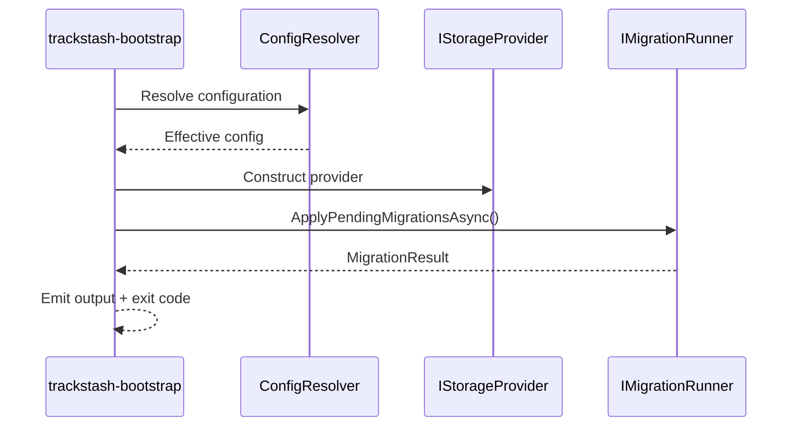
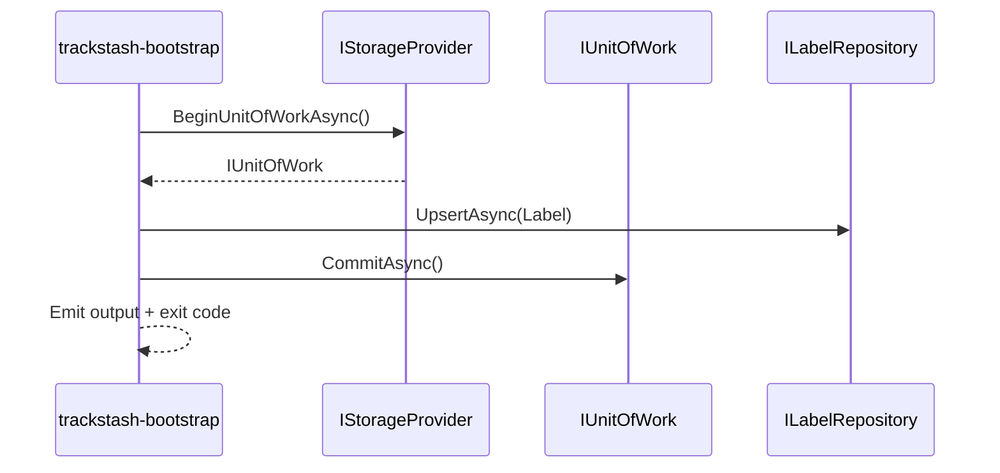

# trackstash-bootstrap Specification (Draft)

Status: draft
Last updated: 2026-06-16

## 1. Purpose

This document defines the implementation specification for `trackstash-bootstrap`.

`trackstash-bootstrap` is an orchestration boundary that:

- initializes storage
- applies migrations
- seeds starter canonical entities
- reports operational readiness

It composes:

- storage contracts from `trackstash-core`
- concrete adapters such as `TrackStash.Core.Sqlite`

It does not own storage contracts, domain models, or provider internals.

## 2. Scope

In scope for MVP:

- CLI executable scaffold
- command parsing and validation
- provider/bootstrap configuration
- migration orchestration via `IMigrationRunner`
- standalone `migrate` command
- label seed path via `ILabelRepository`
- status command for readiness and migration state
- stable exit codes

Out of scope for MVP:

- remote sync
- embedding generation
- bulk import pipelines for all entities
- advanced diagnostics/repair flows

## 3. Dependencies and Contracts

`trackstash-bootstrap` should depend on:

- `TrackStash.Core.Storage.IStorageProvider`
- `TrackStash.Core.Storage.IMigrationRunner`
- `TrackStash.Core.Storage.IUnitOfWork`
- `TrackStash.Core.Storage.ILabelRepository`

Core records referenced in MVP:

- `TrackStash.Core.Storage.Label`
- `TrackStash.Core.Storage.MigrationResult`
- `TrackStash.Core.Storage.StorageCapabilities`

Contract source:

- `../trackstash-core/src/TrackStash.Core/Storage/Contracts.cs`
- `../trackstash-core/src/TrackStash.Core/Storage/Models.cs`

## 4. CLI Contract (MVP)

Executable name (tentative): `trackstash-bootstrap`

### 4.1 Global Options

- `--provider <name>`
- `--db-path <path>`
- `--config <path>`
- `--output <text|json>`
- `--verbosity <quiet|normal|detailed|debug>`

### 4.2 Commands

#### `init-db`

Purpose:

- ensure database exists and is reachable
- apply pending migrations

Options:

- `--migrate <auto|manual|off>` (default `auto`)
- `--target-version <int>` (optional, only for future controlled migration mode)

Behavior:

- resolve configuration
- construct provider
- if `migrate=auto`, apply all pending migrations
- return resulting migration/version state

Idempotency:

- repeated runs should be safe
- if already up to date, no schema changes are applied

#### `migrate`

Purpose:

- apply pending migrations to an existing database

Options:

- none beyond global options for MVP

Behavior:

- resolve configuration
- construct provider
- apply all pending migrations
- return current migration/version state

Idempotency:

- repeated runs should be safe
- if already up to date, no schema changes are applied

#### `status`

Purpose:

- report provider and database readiness
- report migration version and pending state
- report provider capabilities

Options:

- none beyond global options for MVP

Behavior:

- resolve configuration
- construct provider
- read current migration version
- emit readiness payload

#### `seed-label`

Purpose:

- upsert one label record into canonical storage

Options:

- `--id <label-id>` (required)
- `--name <name>` (required)
- `--normalized-name <normalized>` (optional)
- `--sort-name <sort-name>` (optional)
- `--source <provider>` (optional)
- `--external-id <external-id>` (optional, requires `--source`)
- `--dry-run` (optional)

Behavior:

- validate arguments
- begin unit of work
- materialize `Label` record
- `Labels.UpsertAsync(...)`
- commit unit of work
- return summary of created/updated outcome

Idempotency:

- repeated runs with same identity should result in deterministic upsert

## 5. Exit Codes

- `0`: success
- `1`: unexpected unhandled failure
- `2`: invalid arguments or configuration
- `3`: provider initialization failure
- `4`: migration failure
- `5`: seed operation failure
- `6`: status check failed (database unreachable or inconsistent)

## 6. Configuration Specification

Configuration precedence (highest to lowest):

1. CLI flags
2. environment variables
3. config file
4. defaults

### 6.1 Proposed Keys

- `provider`: `sqlite` (MVP)
- `sqlite.dbPath`: path to database file
- `migrations.mode`: `auto|manual|off`
- `output.format`: `text|json`
- `logging.verbosity`: `quiet|normal|detailed|debug`

### 6.2 Environment Variable Mapping (Draft)

- `TRACKSTASH_PROVIDER`
- `TRACKSTASH_SQLITE_DB_PATH`
- `TRACKSTASH_MIGRATIONS_MODE`
- `TRACKSTASH_OUTPUT_FORMAT`
- `TRACKSTASH_VERBOSITY`

Validation rules:

- `provider` is required (default may be `sqlite` for local dev)
- `sqlite.dbPath` is required when `provider=sqlite`
- `migrations.mode` must be one of allowed enum values

## 7. Runtime Lifecycle

### 7.1 Common Execution Pipeline

1. Parse command and global options.
2. Resolve merged configuration.
3. Validate command-specific requirements.
4. Construct `IStorageProvider` for configured provider.
5. Execute command-specific workflow.
6. Emit text or JSON output.
7. Return stable exit code.

### 7.2 `init-db` Sequence

### 7.3 `seed-label` Sequence

## 8. Output Shape

### 8.1 Text Mode

Human-readable summaries intended for interactive use.

Example (`init-db`):

- provider: sqlite
- database: /path/to/trackstash.db
- currentVersion: 1
- appliedMigrations: 0
- status: up-to-date

### 8.2 JSON Mode

Machine-friendly deterministic object with:

- `command`
- `ok`
- `exitCode`
- `timestampUtc`
- `data` object (command-specific)
- `errors` array (if any)

## 9. Seed Data Rules (MVP)

For `seed-label` command:

- `Label.Id` must be non-empty
- `Label.Name` must be non-empty
- `Label.NormalizedName` should be supplied or computed by a shared normalization utility (TBD location)
- if both `source` and `external-id` are set, include one primary `EntityReference`

Conflict behavior:

- default mode is upsert/replace for mutable fields
- immutable identity mismatch should fail validation (final rule TBD)

## 9.1 Domain Seeding Rollout Plan

Seeding should expand in phases to reduce implementation churn while contracts stabilize.

### Phase 1 (MVP): Label-Only Seeding

Commands in scope:

- `seed-label`

Goals:

- prove command pipeline end-to-end
- prove config resolution and provider construction
- prove transactional upsert and idempotency behavior
- prove output and exit-code contract

Promotion criteria to Phase 2:

- `seed-label` passes unit + integration tests
- repeated runs are deterministic and idempotent
- output contract is stable in text and JSON modes
- validation/error mapping is stable and documented

### Phase 2: Artist Seeding

Commands in scope:

- `seed-artist`

Goals:

- extend identity and normalized-name upsert semantics
- confirm alias and external-reference handling for a second entity type

Promotion criteria to Phase 3:

- artist upsert behavior documented and deterministic
- label + artist seeding can run in any order without integrity issues
- integration tests validate readback and idempotency for both entities

### Phase 3: Release and Recording Seeding

Commands in scope:

- `seed-release`
- `seed-recording`

Goals:

- implement cross-entity link semantics (artist credits, label links, release links)
- define ordering/dependency strategy for related entity upserts
- lock conflict rules for ISRC/title/mix normalization

Promotion criteria to Phase 4:

- relationship write rules finalized and documented
- referential integrity behavior validated in integration tests
- conflict-handling policy finalized for mutable vs immutable identity fields

### Phase 4: Bulk Import

Commands in scope:

- `import-csv` (or equivalent)

Goals:

- provide high-throughput ingestion using already-proven single-entity semantics
- support partial failure reporting and resumable runs

Promotion criteria to General Availability:

- bulk import preserves per-entity idempotency guarantees
- error reporting supports triage and retry workflows
- performance and operational behavior meet expected dataset sizes

## 10. Logging and Observability

Minimum requirements:

- all command starts/stops logged at `normal`
- command duration and result logged at `detailed`
- stack traces only at `debug`
- no sensitive secret values in logs

## 10.1 Embedding Strategy Alignment

Embedding timing is a core architecture rule and is defined in:

- `../trackstash-core/docs/storage-interface.md`

Bootstrap-specific behavior:

- bootstrap seed commands should commit canonical entity upserts even if embedding generation is unavailable
- default bootstrap behavior should defer embedding generation
- bootstrap may expose an explicit synchronous embedding mode for small/manual runs only
- bootstrap should support catch-up/backfill command flows for pending or stale embeddings

## 10.2 Normalization Strategy Alignment

Normalization ownership is a core architecture rule and is defined in:

- `../trackstash-core/docs/storage-interface.md`

Bootstrap-specific behavior:

- seed and import commands should call shared core normalization utilities before upsert
- bootstrap should not define its own normalization algorithm
- bootstrap should use duplicate-avoidance lookup order before creating canonical rows: external reference lookup first, normalized-field lookup second, and create a new canonical identity only when no deterministic match exists
- when normalized lookup returns ambiguous candidates, bootstrap should fail with a review-required result rather than auto-merging

## 11. Testing Matrix

### 11.1 Unit Tests

- argument parsing and required option validation
- configuration precedence resolution
- exit code mapping
- JSON output contract shape

### 11.2 Integration Tests (SQLite)

- `init-db` creates/opens DB and applies migrations
- repeated `init-db` is idempotent
- `status` reports reachable DB and current version
- `seed-label` upserts and can be read back through repository

### 11.3 Failure-Path Tests

- invalid provider
- missing SQLite path
- migration execution exception
- unit-of-work commit failure

## 12. Open Decisions

- final executable project type and packaging approach
- configuration file format (`json` vs `yaml`)
- normalization utility location and algorithm
- whether `seed-label` should accept payload files in MVP
- `migrate` is a standalone command in MVP

## 13. Implementation Checklist

1. Scaffold executable project under `trackstash-bootstrap`.
2. Add provider factory abstraction for `sqlite` selection.
3. Implement shared config resolver and validator.
4. Implement `init-db` command with migration orchestration.
5. Implement `status` command with capabilities + version report.
6. Implement `seed-label` command with transactional upsert.
7. Add JSON output formatter and exit-code mapper.
8. Add unit and integration test projects.
9. Document command examples in `README.md` after behavior is implemented.
